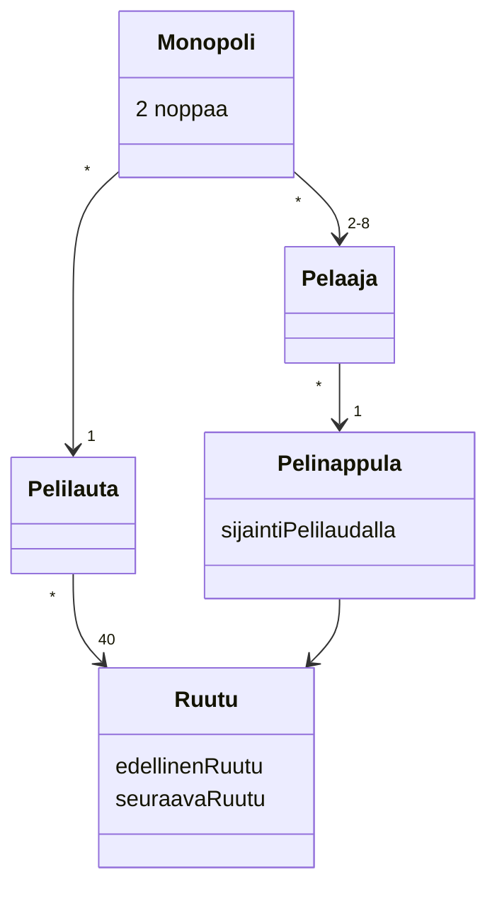

```mermaid
classDiagram
    Monopoli "*" --> "2-8" Pelaaja
    Monopoli "*" --> "1" Pelilauta
    Pelilauta "*" --> "40" Ruutu
    Pelaaja "*" --> "1" Pelinappula
    Pelinappula --> Ruutu
    class Monopoli{
        2 noppaa
    }
    class Pelaaja{
    }
    class Pelilauta{
    }
    class Ruutu{
        edellinenRuutu
        seuraavaRuutu
    }
    class Pelinappula{
        sijaintiPelilaudalla
    }
```