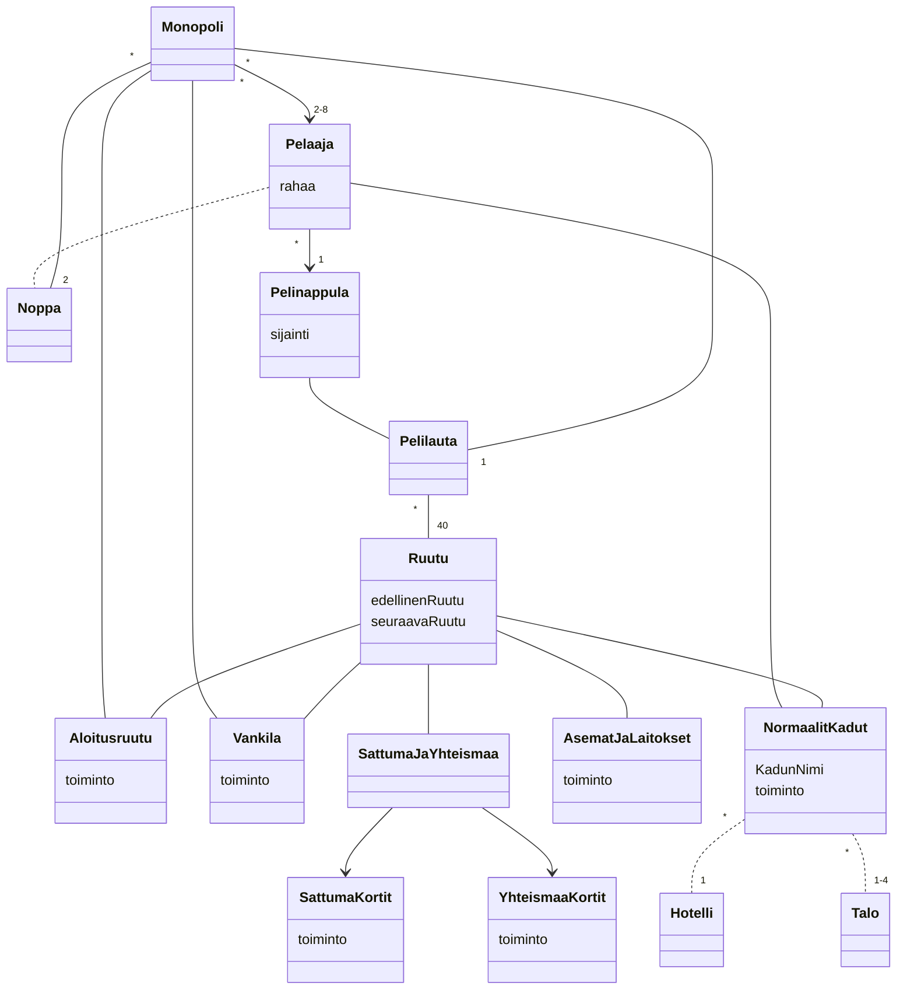

```mermaid
classDiagram
    Monopoli "*" --> "2-8" Pelaaja
    Monopoli "*" -- "1" Pelilauta
    Monopoli "*" -- "2" Noppa
    Pelilauta "*" -- "40" Ruutu
    Pelaaja "*" --> "1" Pelinappula
    Pelaaja .. Noppa
    Pelinappula -- Pelilauta
    Ruutu -- Aloitusruutu
    Ruutu -- Vankila
    Ruutu -- SattumaJaYhteismaa
    Ruutu -- AsematJaLaitokset
    Ruutu -- NormaalitKadut
    SattumaJaYhteismaa --> SattumaKortit
    SattumaJaYhteismaa --> YhteismaaKortit
    Monopoli -- Aloitusruutu
    Monopoli -- Vankila
    NormaalitKadut "*" .. "1" Hotelli
    NormaalitKadut "*" .. "1-4" Talo 
    NormaalitKadut -- Pelaaja


    class Monopoli{
    }
    class Pelaaja{
        rahaa
    }
    class Pelilauta{
    }
    class Ruutu{
        edellinenRuutu
        seuraavaRuutu
    }
    class Pelinappula{
        sijainti
    }
    class Noppa{
        
    }
    class Aloitusruutu{
        toiminto
    }
    class Vankila{
        toiminto
    }
    class SattumaJaYhteismaa{
    }
    class AsematJaLaitokset{
        toiminto
    }
    class NormaalitKadut{
        KadunNimi
        toiminto
    }
    class SattumaKortit{
        toiminto
    }
    class YhteismaaKortit{
        toiminto
    }
```