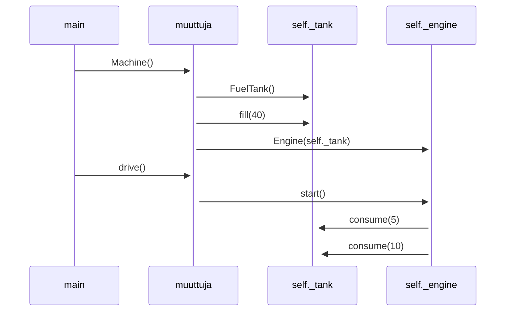

```mermaid
sequenceDiagram
    main->>+muuttuja: Machine()
    muuttuja ->>+ self._tank: FuelTank()
    muuttuja ->>+ self._tank: fill(40)
    muuttuja ->>+ self._engine: Engine(self._tank)
    main ->>+ muuttuja: drive()
    muuttuja ->>+ self._engine: start()
    self._engine ->>+ self._tank: consume(5)
    self._engine ->>+ self._tank: consume(10)

```

