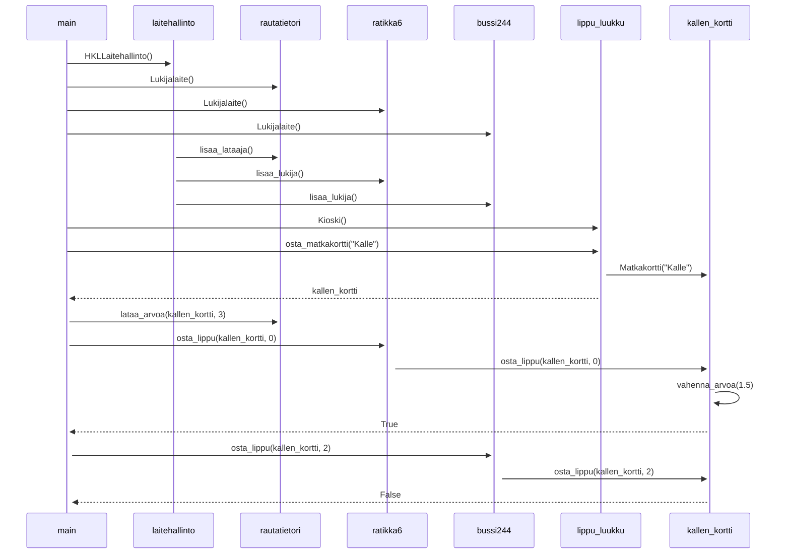

```mermaid
sequenceDiagram
    main->>+laitehallinto: HKLLaitehallinto()
    main ->>+rautatietori: Lukijalaite()
    main ->>+ratikka6: Lukijalaite()
    main ->>+ bussi244: Lukijalaite()
    laitehallinto ->>+rautatietori: lisaa_lataaja()
    laitehallinto ->>+ ratikka6: lisaa_lukija()
    laitehallinto ->>+ bussi244: lisaa_lukija()
    main ->>+ lippu_luukku: Kioski()
    main ->>+ lippu_luukku: osta_matkakortti("Kalle")
    lippu_luukku ->>+ kallen_kortti: Matkakortti("Kalle")
    lippu_luukku -->>+ main: kallen_kortti
    main ->>+ rautatietori: lataa_arvoa(kallen_kortti, 3)
    main ->>+ ratikka6: osta_lippu(kallen_kortti, 0)
    ratikka6 ->>+ kallen_kortti: osta_lippu(kallen_kortti, 0)
    kallen_kortti ->>+ kallen_kortti: vahenna_arvoa(1.5)
    kallen_kortti -->>+ main: True
    main ->>+ bussi244: osta_lippu(kallen_kortti, 2)
    bussi244 ->>+ kallen_kortti: osta_lippu(kallen_kortti, 2)
    kallen_kortti -->>+ main: False

```