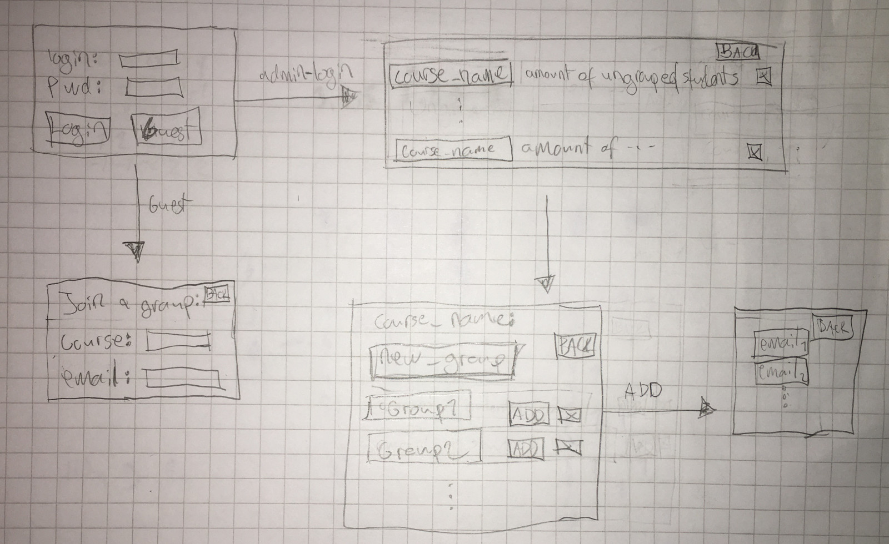

# Vaatimusmääritely 

## Sovelluksen tarkoitus

Sovelluksen tarkoitus on auttaa opiskelijoita löytämään samaa kurssia suorittavia opiskelijoita, joiden kanssa voi suorittaa kurssia yhdessä ja mahdollisesti tekemään harjoitustehtäviä ryhmissä. Sovellus on tarkoitettu käytettäväksi opiskelijoiden kesken, mutta myös opettajat voivat käyttää sovellusta opiskelijoiden ryhmäytymiseen.

## Käyttäjät

Sovelluksella on ainoastaan yksi käyttäjärooli eli _opiskelija_. Myöhemmin sovellukseen saatetaan lisätä suuremmilla oikeuksilla varustettu _ryhmän omistaja_.

## Käyttöliittymäluonnos

Sovellus koostuu kuudesta eri näkymästä. 

Sovellus aukeaa kirjautumisnäkymään, josta voi joko kirjautua sisään tai siirtyä luomaan käyttäjätiliä. Kirjautumisen jälkeen käyttäjä pääsee kurssilistaukseen, josta voi joko valita kurssin tai siirtyä lisäämään uusia kursseja. Kurssivalinnan jälkeen käyttäjä näkee omassa ryhmässä olevien opiskelijoiden yhteystiedot.

## Perusversion tarjoama toiminnallisuus

### Ennen kirjautumista

- Käyttäjän tulee luoda käyttäjätili, jotta hän voi kirjautua sisään sovellukseen.
  - Kirjautumistunnus on sähköpostiosoite. 
- Opiskelija voi kirjautua sisään sovellukseen. 
  - Jos opiskelija on jo luonut käyttäjätilin, hän voi kirjautua sisään syöttämällä sähköpostiosoitteensa ja salasanan.
  - Jos opiskelija ei ole vielä luonut käyttäjätiliä, hän voi siirtyä luomaan käyttäjätilin kirjautumisnäkymästä.
    - Opiskelija voi valinnaisesti lisätä käyttäjätilin tietoihin myös telegram-tilin.
- Jos käyttäjätiliä ei löydy tai salasana ei täsmää käyttäjätiliin, ohjelma ilmoittaa siitä käyttäjälle.

### Kirjautumisen jälkeen

- Käyttäjä näkee omat kurssit, joita hän on lisännyt.
  - Käyttäjä voi lisätä uuden kurssin.
  - Käyttäjä voi poistaa kurssin.
  - Käyttäjä voi valita kurssin, 
    - Ohjelma näyttää valitun kurssin opiskeluryhmässä olevien käyttäjien yhteystiedot.
    - Käyttäjien yhteystiedot näkyvät vain oman ryhmän jäsenille.
- Käyttäjä voi kirjautua ulos sovelluksesta.
- Käyttäjä voi poistaa käyttäjätilinsä.

## Jatkokehitysideoita

Perusversion jälkeen sovellukseen voisi lisätä seuraavia ominaisuuksia:
- Käyttäjä voi lisätä itselle sopivat ajat yhdessäopiskeluun
  - Ryhmänäkymään tulisi näkyville, milloin opiskelijat ovat vapaana yhdessäopiskeluun
- Erilaisten ryhmien luominen
  - Mahdollisuus valita kuinka monta opiskelijaa mahtuu mukaan ryhmään
  - Mahdollisuus luoda etäopiskeluryhmiä
  - Määrittely tavotteista ryhmälle
- Ryhmien näkyminen opiskelijoille, jolloin opiskelija voi valita mihin ryhmään haluaa liittyä
- Ryhmän luoja saa _ryhmän omistajan_ oikeudet
  - Ryhmän omistaja voi kutsua opiskelijoita ryhmään
  - Ryhmän omistaja voi poistaa ryhmän jäseniä
  - Jos ryhmän omistaja poistaa itsensä ryhmästä, ryhmän omistajaksi valitaan ryhmässä oleva opiskelija, joka on ollut ryhmässä kauimmin